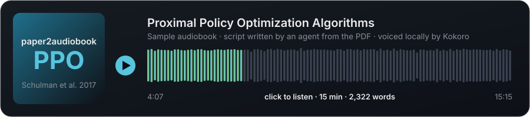
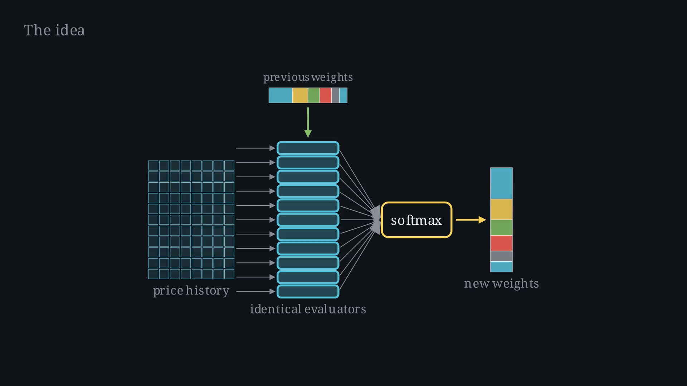

# paper2audiobook

Turn a research paper into a 10 to 15 minute audiobook, or an animated explainer video, that
you can take on a walk.

You give an agent (Claude Code, Codex, Gemini CLI, or similar) a paper. The agent reads it,
decides what matters, and writes a spoken-word script following [GUIDELINES.md](GUIDELINES.md).
One small tool in this repo turns that script into an MP3, or into a Manim video in the style of
3Blue1Brown. The agent does the reading and the thinking. The tool does the voice and the render.

## Listen to a sample

[](samples/ppo-2017-sample.mp4)

Click the card to play it in GitHub's viewer. That is the full audiobook for *Proximal Policy
Optimization Algorithms* (Schulman et al., 2017), written by an agent from the PDF in one pass
and voiced by the default local model. The script it was read from is
[`scripts/example-script.md`](scripts/example-script.md), and the plain audio is
[`samples/ppo-2017.mp3`](samples/ppo-2017.mp3).

## What the audiobook covers

The problem the paper attacks, the core idea, how it differs from current approaches, how the
mechanism works, what was tested and what was not, headline results, and a longer section on
downsides and open problems. It ends with a one-minute recap. No equations, no figure references,
nothing that only makes sense on paper. Read the PDF afterwards if you want the details.

## Usage

Open this repo in your agent and say:

> make me an audiobook of https://arxiv.org/abs/2403.12345

The agent follows [AGENTS.md](AGENTS.md): downloads the PDF, reads it, writes
`scripts/<slug>.md`, runs the tool, and hands you `output/<slug>.mp3`.

For a video, say so:

> make me a video of https://arxiv.org/abs/2403.12345

The agent additionally writes `scenes/<slug>.py` following [VIDEO.md](VIDEO.md) and renders
`output/<slug>.mp4`.

## Setup

```
uv sync
```

Needs `ffmpeg` on the PATH. Kokoro, the default voice model, runs locally and downloads about
300 MB on first use. On Linux with an NVIDIA GPU it uses CUDA, otherwise CPU. Either is fast
enough: a 15-minute audiobook synthesizes in under a minute on a laptop GPU.

Video mode needs the Pango and Cairo development headers before `uv sync`, since Manim compiles
against them:

```
sudo apt install libcairo2-dev libpango1.0-dev      # Debian / Ubuntu
brew install cairo pango                            # macOS
```

If the build fails with `cannot find -lpango-1.0` and you have Anaconda on your PATH, its bundled
compiler is being picked up. Run `CC=/usr/bin/gcc uv sync` instead.

## Audio

```
uv run p2a scripts/example-script.md                      # kokoro, local, default voice
uv run p2a scripts/example-script.md --voice am_adam      # different local voice
uv run p2a scripts/example-script.md --backend openai     # needs OPENAI_API_KEY
uv run p2a scripts/example-script.md --speed 1.15 -o out.mp3
```

Kokoro voices: `af_heart` (default), `af_bella`, `af_sky`, `am_adam`, `am_michael`, `bf_emma`,
`bm_george` and more. The first letter is the accent, `a` American or `b` British. OpenAI voices:
`alloy`, `echo`, `fable`, `onyx`, `nova`, `shimmer`.

Each paragraph of the script is one synthesis unit. Audio is cached per paragraph, so changing
one sentence and re-running only re-synthesizes that paragraph.

## Video

The same script can become an animated explainer. The agent writes a Manim scene file next to
the script with one animation block per paragraph, and the tool plays the narration underneath,
synced automatically. The render refuses to run if the number of blocks does not match the
number of paragraphs.



```
uv run p2a scripts/<slug>.md --video -q low --backend silent   # 480p preview, silent timed audio, ~1 min
uv run p2a scripts/<slug>.md --video                            # 1080p with narration, ~10 min
```

After each render the tool reports, per paragraph, the longest stretch where nothing on screen
moved and any stretch where the screen was empty. That is the agent's cue to add motion or fix a
fade. [VIDEO.md](VIDEO.md) has the style rules.

Inside a scene, reveals can be tied to the narration by quoting it:

```python
with self.narrate() as n:
    self.play(FadeIn(model_box))
    n.until("hand-coded rules")          # waits until the voice reaches that phrase
    self.play(FadeIn(rules_box))
```

With Kokoro the timing comes from the model's word timestamps. With other backends it is
estimated from the position of the phrase in the paragraph.

## Repo layout

```
AGENTS.md         what an agent does, step by step (CLAUDE.md points here)
GUIDELINES.md     audiobook structure, writing-for-the-ear rules, self-check
VIDEO.md          video style rules, scene file format, self-check
p2a/              the tool: script parser, TTS backends, cache, audio assembly, Manim base class
scripts/          agent-written scripts, one per paper, committed
scenes/           agent-written Manim scenes, one per paper, committed
samples/          the PPO sample and README images
papers/           downloaded PDFs, not committed
output/           MP3 and MP4 output, not committed
```

## Tests

```
uv run pytest
```

The audio tests use a fake backend and run in a second. The video tests render a two-paragraph
scene at low quality with silent audio and take a few seconds. No GPU or API key is needed.
